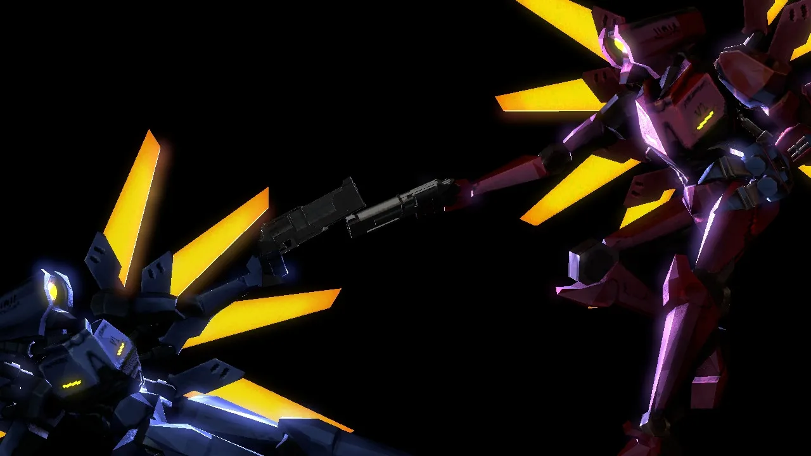
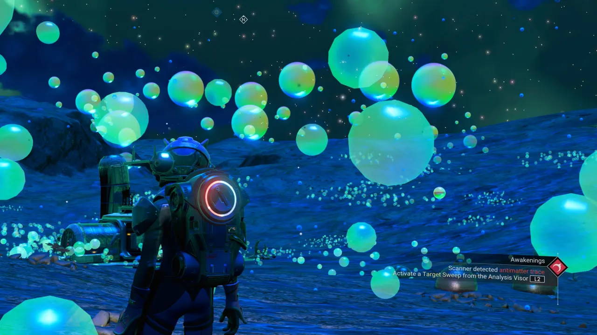
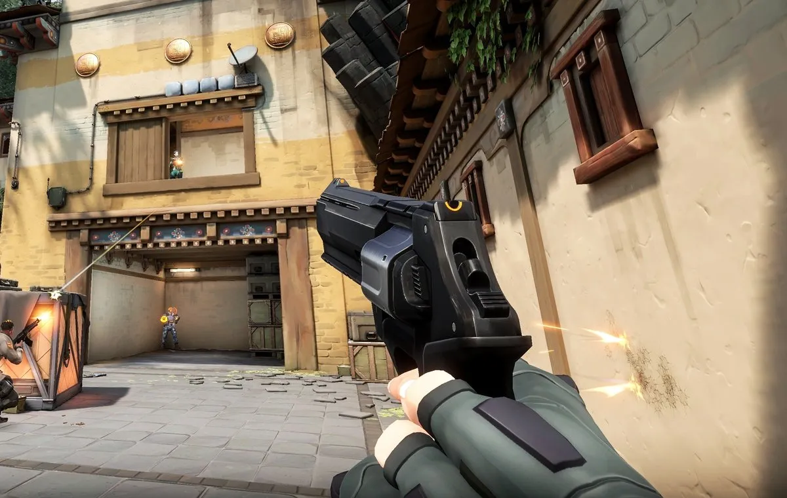
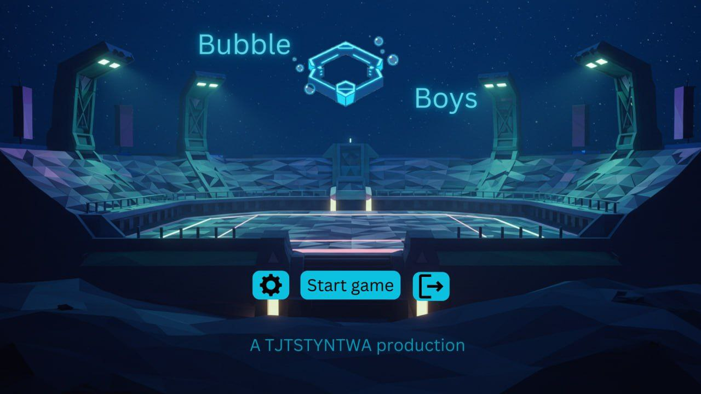
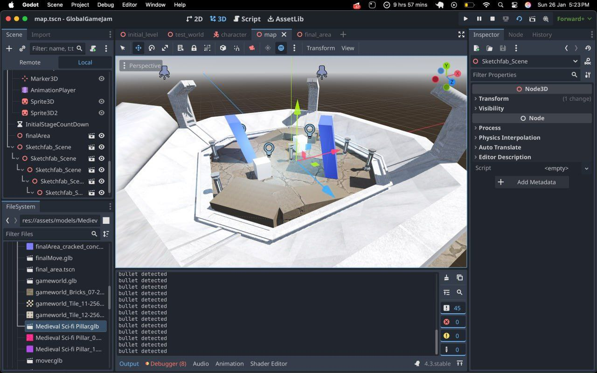
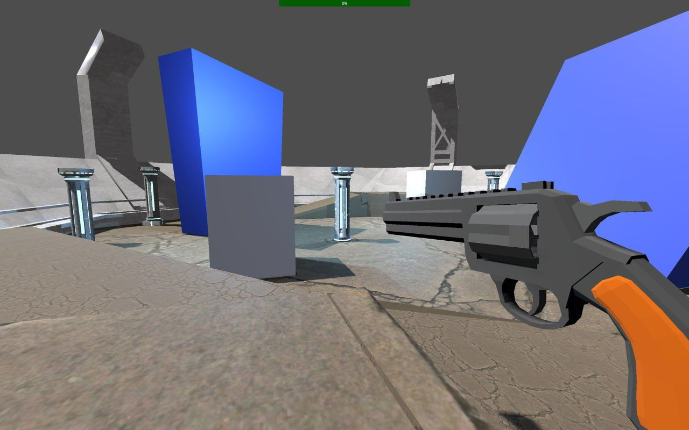
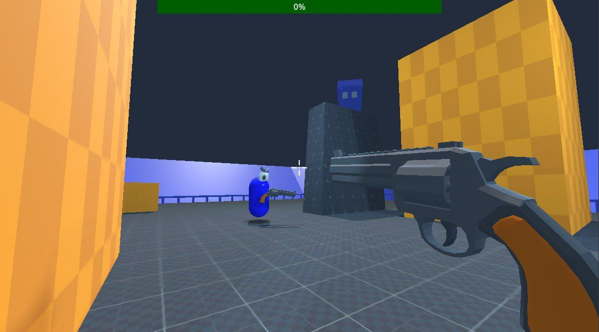
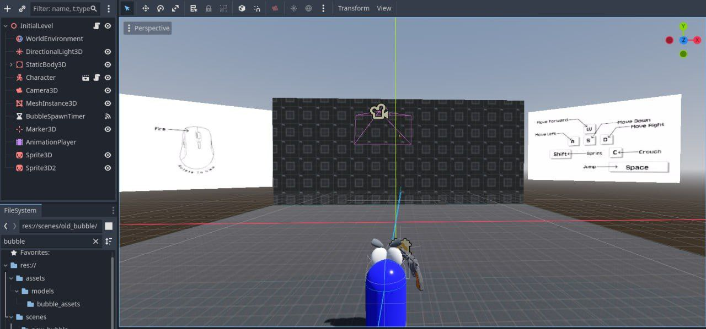

# Bubble Bros (GGJ 2025)
## Executive Pitch
[*A short, 2-3 sentence long pitch about your grame, comparable to your short description on Steam*]

Bubble Bros is a local multiplayer fps game, where you set your stats in a "bubble shooting" stage.
## Mechanics
[*What are the key things a player will be doing? What is part of the core gameplay loop?*]
* Stamina based movement, with limited jumps, wall jumps and dashes
The gun's damage and other player stats can be set during the initial phase
* There will be two "bubble shooting" stages to increase your stats, one during the match. The second one during half time.
* Not doing something stupid like going into the water with a "don't go inside the water" sign next to it.
## Unique Selling Points
[What are your hooks? What makes your game special? Why should people play your game instead?]
* LAN-First Design, solves issues of high latency and unstable internet.
* Optimized for low-spec PCs.
* Designed with Sub-Saharan Africa in mind, where reliable servers, fast internet and PCs with cutting edge specs are often unavailable.
## Story
[*If your game has a narrative, give a high-level breakdown of key story beats here*]
* No story...yet
## Objectives
[*What's the end goal? Is the player working towards something?*]
* Earn as many kills as possible (its a best of 10)
* Increase your stats, and experiment with new builds
# Reference art
[*Replace these with games capturing the same vibe/style as your game*]

    

        
        
Movement inspired by Ultrakill

    

    

        
        
Bubbles will be similar to Sabaody Archipelago in One Piece

    

    

        
        
Deagle

    

# How to Play
- Connect two devices to the same Wi-Fi, ideally a hotspot.
- Run `ipconfig` on the host's PC.
- Get the host's IP address (the number next to "IPv4 Address") and input it into the client's text field.
- Make sure the host starts the game by clicking "Host".
- The client can then click "Join".
- GL HF.

# Screenshots
  

[Game Design Document Template We Used for Our Game](https://youtu.be/xUo0rL2c_LQ?si=-42V7zEGyIX9KOd7)